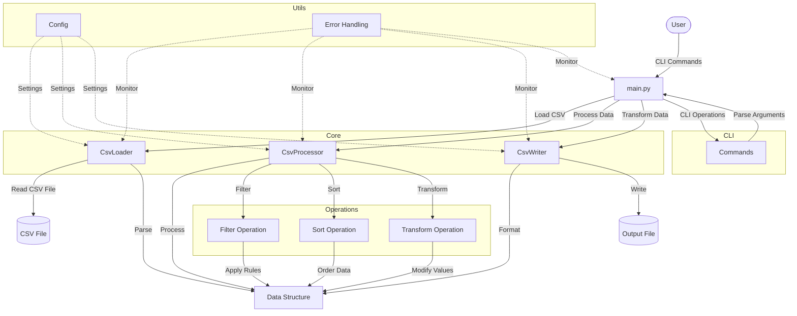
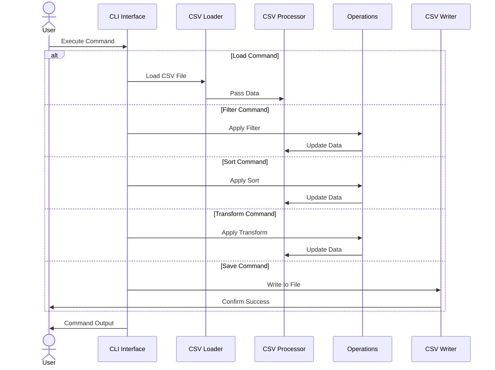
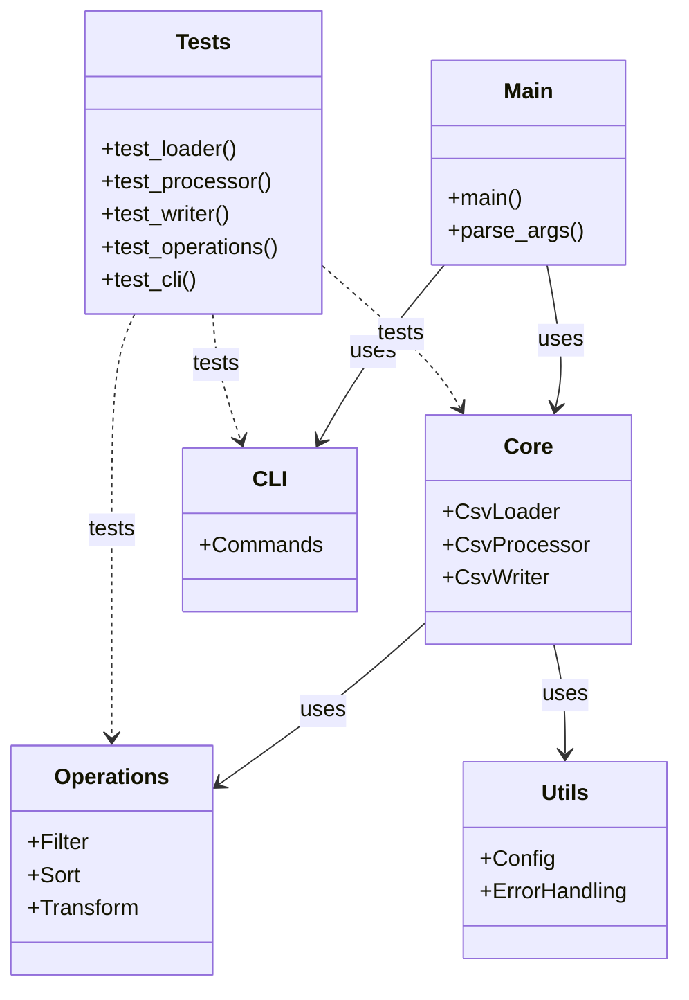
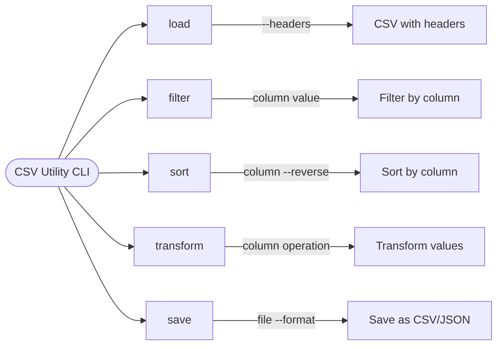

# CSV Utility Architecture

## Component Architecture

```mermaid
graph TD
    User([User]) -->|CLI Commands| Main[main.py]
    Main -->|Load CSV| CL[CsvLoader]
    Main -->|Process Data| CP[CsvProcessor]
    Main -->|Transform Data| CW[CsvWriter]
    Main -->|CLI Operations| Commands[Commands]
    
    Commands -->|Parse Arguments| Main
    
    CL -->|Read CSV File| RawData[(CSV File)]
    CL -->|Parse| Data[Data Structure]
    
    CP -->|Process| Data
    CP -->|Filter| Filter[Filter Operation]
    CP -->|Sort| Sort[Sort Operation]
    CP -->|Transform| Transform[Transform Operation]
    
    Filter -->|Apply Rules| Data
    Sort -->|Order Data| Data
    Transform -->|Modify Values| Data
    
    CW -->|Format| Data
    CW -->|Write| Output[(Output File)]
    
    Config[Config] -.->|Settings| CL
    Config -.->|Settings| CP
    Config -.->|Settings| CW
    
    ErrorHandling[Error Handling] -.->|Monitor| CL
    ErrorHandling -.->|Monitor| CP
    ErrorHandling -.->|Monitor| CW
    ErrorHandling -.->|Monitor| Main
    
    subgraph Core
        CL
        CP
        CW
    end
    
    subgraph Operations
        Filter
        Sort
        Transform
    end
    
    subgraph Utils
        Config
        ErrorHandling
    end
    
    subgraph CLI
        Commands
    end
```

## Data Flow

```mermaid
sequenceDiagram
    actor User
    participant CLI as CLI Interface
    participant Loader as CSV Loader
    participant Processor as CSV Processor
    participant Operations as Operations
    participant Writer as CSV Writer
    
    User->>CLI: Execute Command
    
    alt Load Command
        CLI->>Loader: Load CSV File
        Loader->>Processor: Pass Data
    else Filter Command
        CLI->>Operations: Apply Filter
        Operations->>Processor: Update Data
    else Sort Command
        CLI->>Operations: Apply Sort
        Operations->>Processor: Update Data
    else Transform Command
        CLI->>Operations: Apply Transform
        Operations->>Processor: Update Data
    else Save Command
        CLI->>Writer: Write to File
        Writer->>User: Confirm Success
    end
    
    CLI->>User: Command Output
```

## Package Structure

```mermaid
classDiagram
    class Main {
        +main()
        +parse_args()
    }
    
    class Core {
        +CsvLoader
        +CsvProcessor
        +CsvWriter
    }
    
    class Operations {
        +Filter
        +Sort
        +Transform
    }
    
    class Utils {
        +Config
        +ErrorHandling
    }
    
    class CLI {
        +Commands
    }
    
    class Tests {
        +test_loader()
        +test_processor()
        +test_writer()
        +test_operations()
        +test_cli()
    }
    
    Main --> Core : uses
    Main --> CLI : uses
    Core --> Operations : uses
    Core --> Utils : uses
    Tests ..> Core : tests
    Tests ..> Operations : tests
    Tests ..> CLI : tests
```

## Command Line Usage

```mermaid
graph LR
    CLI([CSV Utility CLI]) --> Load[load]
    CLI --> Filter[filter]
    CLI --> Sort[sort]
    CLI --> Transform[transform]
    CLI --> Save[save]
    
    Load -->|--headers| LoadOptions[CSV with headers]
    Filter -->|column value| FilterOptions[Filter by column]
    Sort -->|column --reverse| SortOptions[Sort by column]
    Transform -->|column operation| TransformOptions[Transform values]
    Save -->|file --format| SaveOptions[Save as CSV/JSON]
```